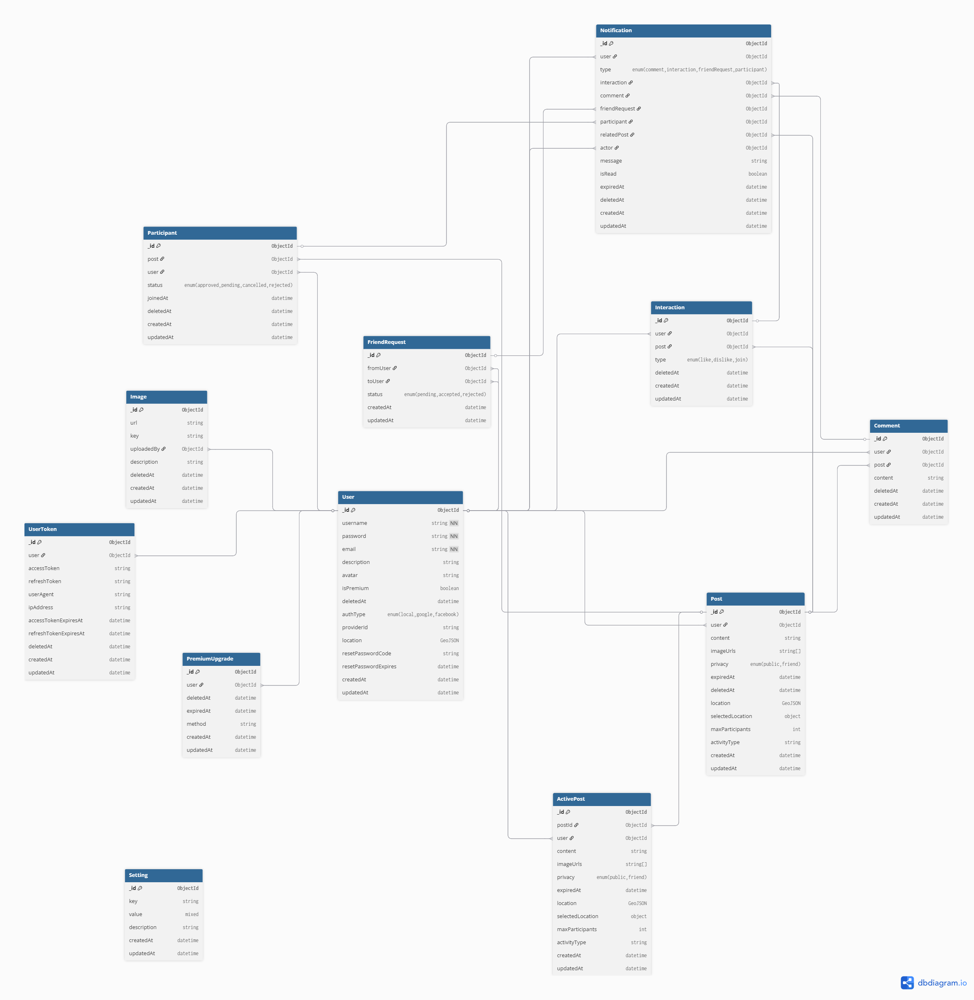

# RENDEZVOUS

### 1. Functional Overview

**Rendezvous** is a mobile/web social networking platform designed to connect people based on their geographic location. It enables users to easily discover and join spontaneous social activities such as grabbing coffee, hanging out, or participating in any meetup within a specific time and place. The app emphasizes spontaneity and real-world interaction, helping users connect with others who share similar interests nearby.

**Main Objectives:**
- Allow users to create short-term meetup posts ("invitations") with location and images.
- Display active invitations within a nearby radius of the user.
- Provide simple interaction tools (like, dislike, join, comment) for each invitation.
- Support friend connections and privacy control for posts.
- Differentiate between Regular and Premium accounts with additional privileges.

#### Backend Responsibilities

This repository contains the **backend service** of Rendezvous.  
It is responsible for handling data, authentication, and API logic that powers the client applications.

**Core Responsibilities:**
- Provide RESTful APIs for mobile/web clients.  
- Manage authentication (JWT-based) and user sessions.  
- Store and serve user data and posts via **MongoDB**.  
- Integrate **HERE Maps API** for geolocation and nearby post search.  
- Handle image upload and storage with **AWS S3**.  
- Manage friend requests, interactions, and notifications.  
- Expose API documentation through **Swagger UI** for easy testing.  

**Deployment:**
- The backend service is deployed on **Render Cloud Platform**.
- Live API base URL:
    👉 [https://rendezvous-svc.onrender.com](https://rendezvous-svc.onrender.com)  
- Swagger API documentation:
    👉 [https://rendezvous-svc.onrender.com/api-docs](https://rendezvous-svc.onrender.com/api-docs)

_This backend is actively under development._

---
### 2. Built with

This project is built with the following main technologies:

- 
- 
- 
- 
- ...

---
### 3. Data Model (EER Simulation for MongoDB)

Although Rendezvous uses **MongoDB** (a NoSQL document-oriented database), its schema is designed following **EER (Enhanced Entity-Relationship)** principles to ensure clear structure and data integrity between entities.

You can view the full data model here:  
[View on dbdiagram.io](https://dbdiagram.io/d/Rendezvous-683963c3bd74709cb73de921)

---
#### Main Collections

| Collection | Description (EN) |
|-------------|------------------|
| **User** | Stores user profiles, authentication info, location, and account type (Regular/Premium). |
| **UserToken** | Stores access/refresh tokens, linked with device info. |
| **Setting** | Key-value configuration table for global system settings. |
| **PremiumUpgrade** | Tracks premium upgrade transactions and expiration dates. |
| **Post** | Represents user invitations (meetups) with content, image, location, and expiry time. |
| **Participant** | Tracks users joining a post and their approval status. |
| **Notification** | Stores notifications for comments, likes, friend requests, etc. |
| **Interaction** | Records user interactions on posts (like, dislike, join). |
| **Image** | Stores uploaded images and metadata (e.g., S3 key, uploader). |
| **FriendRequest** | Manages friend request relationships between users. |
| **Comment** | User comments under posts. |
| **ActivePost** | Cached data for currently active posts for quick nearby lookup. |

---
#### Relationships Overview

- **User – Post:** one-to-many -> A user can have many posts.
- **Post – Participant:** one-to-many -> A post can include multiple participants.
- **User – Interaction:** one-to-many -> One user can interact with many posts (like or dislike).
- **User – FriendRequest:** many-to-many -> Two users can send friend requests to each other.
- **Post – Comment:** one-to-many -> One post can include many comments.
- **User – Notification:** one-to-many -> One user can receive many notifications .
- **Post – ActivePost:** one-to-one -> One post has one active post. ActivePost is a temporary copy of Post used for fast searching.

---
#### EER Diagram Preview
> *(Click the image or link below to view full diagram on dbdiagram.io)*

[](https://dbdiagram.io/d/Rendezvous-683963c3bd74709cb73de921)

---
### 4. Installation & Run

#### Requirements

Before running the project, make sure you have:

- [Node.js](https://nodejs.org/) (v18+)
- [MongoDB](https://www.mongodb.com/try/download/community) (local or cloud, e.g. Atlas)
- [Git](https://git-scm.com/)

---
#### 1. Clone the repository

```bash
git clone https://github.com/advaita02/rendezvous-svc
cd rendezvous
npm install
```

#### 2. Create Environment File (.env)

Before running the project, create a `.env` file in the root directory.

```bash
touch .env
```

Then, open it and add the following environment variables:

```bash
PORT=3000
MONGODB_URI=mongodb+srv://<username>:<password>@cluster0.mongodb.net/?retryWrites=true&w=majority
JWT_SECRET=secret_key_jwt
REFRESH_SECRET=refresh_secret_key_jwt
```
#### 3. Run the Application

Start the development server:

```bash
npm start
```

Once the server is running, open your browser and go to: http://localhost:3000

---

#### 5. API Documentation (Swagger UI) 

Rendezvous provides an integrated Swagger UI to explore and test all available API endpoints.

After starting the server, visit: http://localhost:3000/api-docs

Here you can:

- View detailed documentation for each endpoint.
- Try requests directly from the browser.
- Check authentication and response formats.

#### Contact
If you have any questions or feedback, feel free to reach out:
- **Email**: [lbnam1609@gmail.com](mailto:lbnam1609@gmail.com)
- **Github**: [lbnam25](https://github.com/advaita02)