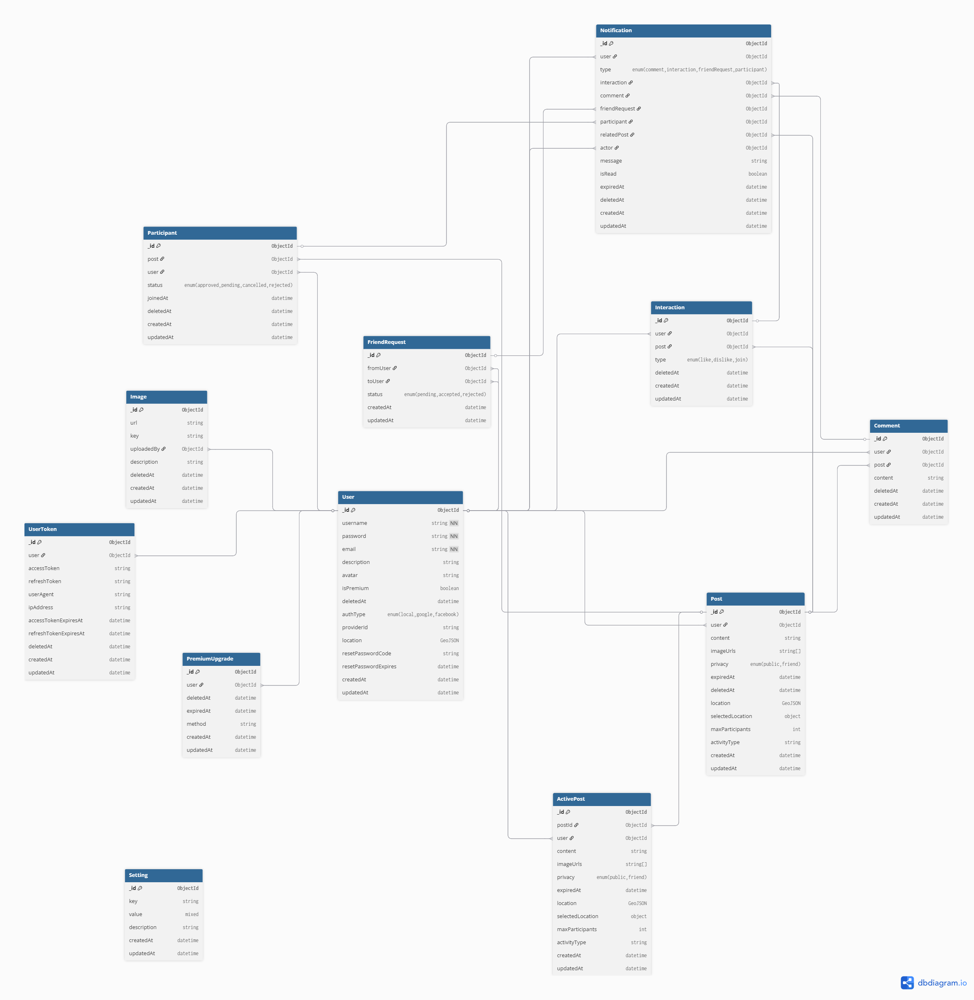

# RENDEZVOUS

### 1. Functional Overview

**Rendezvous** is a mobile/web social networking platform designed to connect people based on their geographic location. It allows users to easily discover and join social gatherings such as coffee meetups or hangouts, through posts created by other users. The app emphasizes casual plans and real-world interaction, helping users connect with others who share similar interests nearby.

**Main Objectives:**
- Allow users to create short-term meetup posts ("invitations") with location and images.
- Display active invitations within a nearby radius of the user.
- Provide simple interaction tools (like, dislike, join, comment) for each invitation.
- Support friend connections and privacy control for posts.
- Separate Regular and Premium users.

#### Backend Responsibilities

This repository contains the **backend service** of Rendezvous.  
It is responsible for handling data, authentication, and API logic that supports the client applications.

**Core Responsibilities:**
- Provide RESTful APIs for mobile/web clients.
- Manage authentication (JWT-based) and user sessions.
- Store and serve data via **MongoDB**.
- Integrate **HERE Maps API** for geolocation, autosuggest, and browse search.
- Handle image upload and storage with **AWS S3**.
- Manage posts, friend requests, interactions, and notifications.
- Expose API documentation through **Swagger UI** for easy testing.

**Deployment:**
- The backend service is deployed on **Render**.
- Live API base URL:
    👉 [https://rendezvous-svc.onrender.com](https://rendezvous-svc.onrender.com)
- Swagger API documentation:
    👉 [https://rendezvous-svc.onrender.com/api-docs](https://rendezvous-svc.onrender.com/api-docs)

_This backend is under development._

---
### 2. Built with

This project is built with the following main technologies:

- 
- 
- 
- 
- ...

---
#### ER Diagram Preview
> *(Click the image or link below to view full diagram on dbdiagram.io)*

---

#### Contact
If you have any questions or feedback, feel free to reach out:
- **Email**: [lbnam1609@gmail.com](mailto:lbnam1609@gmail.com)
- **Github**: [lbnam25](https://github.com/advaita02)
